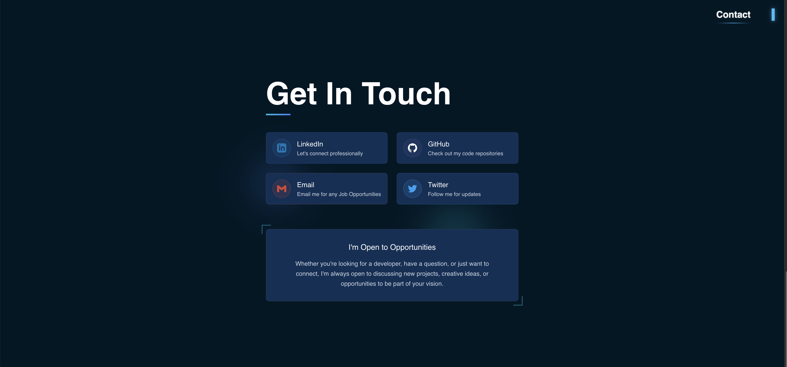
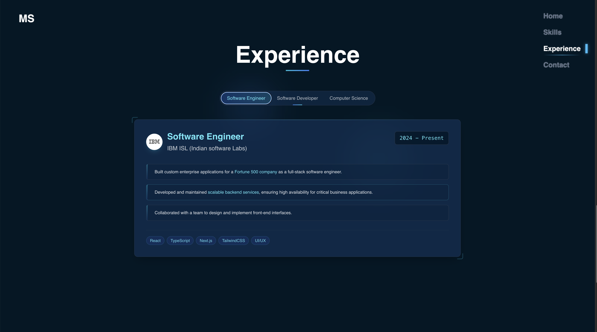

# Portfolio Website


## ✨ Overview

An immersive 3D developer portfolio website showcasing my projects and skills through interactive parallax effects, animations, and 3D graphics.


## 🚀 Features

- **Immersive 3D Environment** - Interactive space-themed design with Three.js
- **Parallax Effects** - Dynamic elements that respond to user movement
- **Responsive Design** - Optimized for all device sizes (with minor parallax limitations on small screens)
- **Project Showcase** - Highlighted portfolio projects with descriptions and links
- **Smooth Animations** - Engaging transitions powered by Framer Motion

## 🛠️ Technologies

<table>
  <tr>
    <td align="center"><br />Vite</td>
    <td align="center"><br />JavaScript</td>
    <td align="center"><br />React</td>
    <td align="center"><br />Tailwind</td>
  </tr>
  <tr>
    <td align="center"><br />Three.js</td>
    <td align="center"><br />Framer Motion</td>
    <td align="center"><br />GitHub</td>
  </tr>
</table>

## 🏗️ Installation & Setup

```bash
# Clone the repository
git clone https://github.com/yourusername/portfolio-website.git

# Navigate to the project
cd portfolio-website

# Install dependencies
npm install

# Run development server
npm run dev
```

## 📷 Screenshots

<div align="center">
  
  
  <div style="display: flex; justify-content: space-between; margin-bottom: 20px">
    
    
  </div>
  
  
</div>

## 💡 Implementation Details

I built 3D portfolio graphics and interactive animations create a memorable experience for prospective clients and employers, while the intuitive design ensures easy navigation.

The parallax effects respond dynamically to user movement, creating depth and dimension. Three.js powers the 3D elements, while Framer Motion handles smooth transitions and animations throughout the interface.

## 🙏 Credits & Resources

- [Spaceman 3D Model](https://sketchfab.com/3d-models/tenhun-falling-spaceman-fanart-9fd80b6a259f41fd99e6f56eee686dc5) by wallmasterr
- [Planet Surface Texture](https://stock.adobe.com/images/landscape-surface-of-planet-sky-space-science-fiction-fantasy-illustration/330880441?asset_id=330880441) by jongjawi
- [Position Animation Reference](https://github.com/teshank2137/portfolio) by Teshank